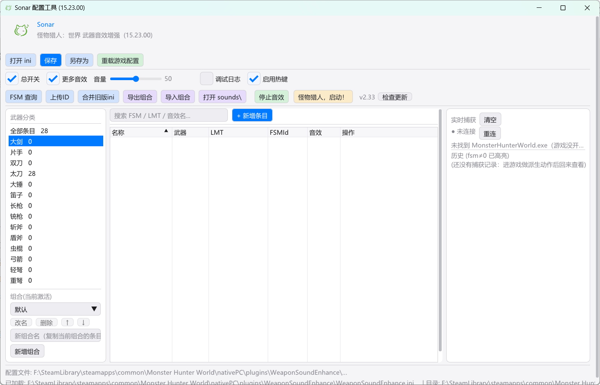

# Sonar

<div align="center">
  
</div>

给《怪物猎人：世界 / 冰原》(15.23.00) 增加「武器派生攻击音效」的原生 DLL 插件。

先**探测**玩家当前的动作与战斗状态，再**判定**这一招的结果，最后**发声** —— 故名 **Sonar**（声呐）。

## 这是什么

**Sonar** 给你的每一次武器攻击配上自己的音效：插件在游戏内**监听动作与战斗状态**，
按动作、刃色、是否命中、伤害高低等条件，把你准备的声音**叠加**进游戏里播放。

- **不改动任何游戏文件**：一个 DLL + 一份配置即可，和别的音效 mod 不冲突。
- **条件触发**：同一招可以「打中响 A、落空响 B」，不同刃色、不同伤害段位也能各响一套。
- **图形界面**：选武器 → 加条目 → 挑音频 →（可选）设条件 → 保存，游戏内立刻重载，不用重启。
- **内置 nbnk 制作**：需要做"传统 mod"（不依赖插件在跑）时，工具能导入 nbnk、替换音效并导出。
- **WEM 捕获（实验性）**：把游戏正在播放的音效抓出来直接试听，方便确认"这一招到底响了哪几个 wem"。

> 两种做法**都只有自己听得到**：`nativePC` 是本地文件，联机时队友用的是他们自己机器上的音效。
> 区别不在"谁能听到"，而在**改动的原生程度**与**触发条件能有多细**。

## 与传统 nbnk mod 的区别

| | 传统 nbnk mod | Sonar |
| --- | --- | --- |
| 原理 | 替换游戏 nbnk 里的 wem 数据 | 插件在游戏内**触发**你自己的音效 |
| 是否改游戏文件 | 会（用 nativePC 覆盖原 bank） | **不改任何游戏文件** |
| **原生程度** | **由游戏音频引擎直接播放**（和原版音效同一条链路，不依赖插件在跑） | 插件在游戏内额外触发播放，**需要插件在运行** |
| 原版音效 | 被替换掉，听不到 | **可保留**（原音与你的音效同时响），也可只响你的 |
| 触发时机 | 只能"原本该响的那一刻" | 动作 / 刃色 / 命中判定 / 伤害阈值 / 延迟窗口等条件 |
| 同一招多套音效 | 做不到（一条 wem 一个声音） | 可以（按条件播放不同音效池） |
| 与其他音效 mod | 改到同一个 bank 会互相覆盖 | **可共存**（不抢 bank） |
| 生效方式 | 换 bank 后需重载（一般切武器种类再切回） | 配置热重载（GUI 保存 / 游戏内 `/wse reload`） |
| 上手门槛 | 需要 Wwise 工具链、知道 media id | 图形界面点选；「nbnk 制作」页也能一键生成传统 mod |

**怎么选**

- 想要**最原生**的效果（由游戏音频引擎直接播放、不依赖插件在跑），或替换某个全局音效 → 用「**nbnk 制作**」（传统 mod 路线，工具自动完成格式转换与导出）。
- 想让**自己的动作按条件响**（命中/刃色/伤害段位）、保留原音、且不动游戏文件、不与其他 mod 冲突 → 用 **Sonar 的条目触发**。
- 两者也可以**一起用**：先用 nbnk 制作换掉底噪/全局音，再用 Sonar 给特定招式叠加条件音效。

本页按**配置工具（GUI）的实际操作顺序**讲：装好 → 打开 → 加条目 → 配音效 →（可选）条件判定 → 保存 → 游戏内生效 → 分享组合。

| 想做什么 | 看哪一节 |
| --- | --- |
| 刚装上，想让它响 | [1. 安装](#1-安装) → [2. 打开配置工具](#2-打开配置工具) → [3. 添加第一条音效](#3-添加第一条音效) |
| 想「打中了才响、落空不响」 | [5. 条件判定：打完再决定播哪个](#5-条件判定打完再决定播哪个) |
| 想换武器/换套配置 | [7. 配置组合](#7-配置组合一套武器多套音效) |
| 想把自己配好的发给别人 | [8. 分享与导入组合](#8-分享与导入组合) |
| 改完不进游戏就生效 | [6. 保存与生效](#6-保存与生效) |
| 按钮/字段不认识 | [10. 界面速查表](#10-界面速查表) |

---

## 1. 安装

1. 确保游戏已装好加载前置（**Stracker's Loader** / 狩技 mod 盒子等）。
2. 把发布包解压到游戏的 `nativePC\plugins\`，形成：

```
Monster Hunter World\
└─ nativePC\
   └─ plugins\
      ├─ WeaponSoundEnhance.dll          ← 插件本体
      └─ WeaponSoundEnhance\             ← 数据目录
         ├─ WeaponSoundEnhanceGUI.exe    ← 配置工具
         ├─ WebView2Loader.dll           ← 配置工具依赖，必须和 exe 放一起
         ├─ web\                         ← 配置工具的界面文件，请勿删除
         ├─ wemkit\                      ← nbnk 制作/试听用的工具（Wwise 工程 + wem 解码器）
         ├─ WeaponSoundEnhance.ini       ← 你的配置
         ├─ fsm_db.csv                   ← 动作 ID 库
         ├─ WseMediaSeqs.txt             ← media id → bank/序号 对照表
         ├─ SonarAudio.mediaids.txt      ← media id → 可读名 对照表
         └─ sounds\                      ← 音效放这里
```

> 首次运行时若没有 `WeaponSoundEnhance.ini`，插件会从 `WeaponSoundEnhance.ini.template` 生成一份。
>
> 配置工具的界面由系统自带的 Edge WebView2 运行时渲染：Win11 与绝大多数 Win10 已内置，
> 极少数精简系统若缺失，启动时会有提示，装一次
> [WebView2 运行时](https://developer.microsoft.com/microsoft-edge/webview2/) 即可。
> `web\` 与 `WebView2Loader.dll` 缺一，界面就会白屏。
>
> 武器图标与界面 logo 已**内嵌在配置工具里**（首次运行会释放到 `%LOCALAPPDATA%\Sonar\assets`），
> 所以目录里不再有 `weapons_icons\`、`sonar_icon.png`。

3. 把你的 `wav / mp3 / ogg / flac` 丢进 `sounds\`（可直接建子文件夹分类，例如 `sounds\太刀\登龙.wav`）。

---

## 2. 打开配置工具

双击 `WeaponSoundEnhanceGUI.exe`：



界面分成几块：

| 区域 | 作用 |
| --- | --- |
| **品牌区** | 顶部：产品名 + 版本 |
| **工具栏** | 文件与生效操作、全局设置、工具（FSM 查询 / ID 库）、组合导入导出、启动游戏 |
| **左栏** | 按武器筛选条目；选中武器后可在下方管理该武器的**配置组合** |
| **中栏** | 条目表格（名称 / 武器 / LMT / FSMId / 音效 / 操作），上方可搜索、新增条目 |
| **右栏** | **实时捕获**：游戏内动作 ID 的实时变化与历史记录，用来找动作的 fsm/lmt |
| **底部** | 状态栏：当前配置文件路径与加载状态 |

**第一次用建议先做两件事**：

- 点 **「调试日志」**（让插件把每次播放写进 `WeaponSoundEnhance.log`，排查时很有用）。
- 点 **「重载游戏配置」** 验证 GUI 能连上游戏（详见 [6](#6-保存与生效)）。

> 右栏显示 **「未连接」** 是正常的 —— 它表示游戏没在运行。启动游戏后会自动连上，
> 那时在游戏里做动作就能看到 `weapon / fsm / lmt` 实时变化。

---

## 3. 添加第一条音效

目标：做出「登龙飞天时播放自定义音效」。

**① 找到要绑定的动作**

在游戏里做一次那个动作，看 GUI 右侧 **实时捕获**：它会实时显示当前的 `weapon / fsm / lmt`。

| 字段 | 含义 |
| --- | --- |
| `weapon` | 武器类型编号（3 = 太刀，0 = 大剑 …） |
| `fsm` | 动作状态机 ID —— **动作的唯一标识**，最常用 |
| `lmt` | 动作资源 ID，同一个 FSM 可能对应多个 LMT |

记下做那个动作时的 `fsm`（和 `lmt`）。

> 也可以用工具栏 **「FSM 查询」** 打开 ID 库，按名字搜（如「登龙」），直接拿到已知的 fsm/lmt。

**② 新增条目**

点 **「＋ 新增条目」**，弹出编辑器：

| 字段 | 怎么填 |
| --- | --- |
| **名称** | 自己看的备注，随便填（如「登龙飞天」） |
| **武器** | 选对应武器；选「任意(-1)」则所有武器通用 |
| **组合** | 归属哪套配置，见 [7](#7-配置组合一套武器多套音效)；不确定就用默认 |
| **FSMId** | 填刚才记下的 `fsm`；填 `-1` = 不限定 |
| **LMT** | 想更精确就填 `lmt`（逗号分隔多个）；留空或勾「LMT 不限」= 只要 FSMId 相同就触发 |

**③ 加音效**

在 **「默认音效」** 区点 **「浏览...」** 多选音频文件，或手输路径（如 `sounds/登龙.wav`）后点「添加」。

每条音效都有三行设置：

| 设置 | 说明 |
| --- | --- |
| **固定(F)** | 勾上则每次触发**必播**；不勾的条目里会**随机抽一条** |
| **延时** | 触发后等多少毫秒再响（0–5000），用来对齐动作的打击帧 |
| **音量** | 0–100，只影响这条音效（再乘工具栏总音量） |
| **冷却** | 这条音效自己的再触发间隔（ms）。`0` = 默认同一文件 400ms 内不重复 |
| **播放期间不重复** | 长音效连续派生时不会叠在一起 |
| **试听** | 立刻播放，调延时/音量时不用进游戏 |

**④ 点「确定」→ 保存 → 生效**（见 [6](#6-保存与生效)）。

> **多条音效随机播**：同一动作加多条、都不勾固定，则每次随机抽一条。
> **同时叠播**：勾了固定的会全部播放，同时再从非固定的里随机抽一条。最多 6 个声部。

---

## 4. 刃时音效（太刀专用）

在编辑器的 **「高级设置」** 里，太刀能按当前气刃等级分别配音效：

| 区域 | 何时响 |
| --- | --- |
| 默认音效(任意刃时) | 没给当前刃色单独配时用它 |
| 无刃时 / 白刃时 / 黄刃时 / 红刃时 | 对应刃色时优先用它 |

设好后，同一招在不同刃色下可以响不同音效。

---

## 5. 条件判定：打完再决定播哪个

有些判断**必须等一会儿才知道结果**：

- 「这招打中了没有」→ 大居合、真蓄力斩
- 「掉刃了没有」→ 太刀大居成功/失败

做法：动作匹配上时不立刻出声，而是**开一个观察窗**盯一段时间，再按条件挑音效池。

**最快上手：用内置预设**（编辑器 →「判定模式」下拉框）

| 预设 | 用途 |
| --- | --- |
| 不判定 | 默认。动作一匹配就播 |
| **造成伤害（命中/落空·任意武器）** | 打出伤害就播【命中】，没打中播【落空】。**不限武器和动作**，任何招式都能用 |
| 太刀 · 登龙 命中/落空 | 登龙专用 |
| 太刀 · 大居 成功/失败 | 掉刃=失败、打出伤害=成功 |
| 大剑 · 真蓄 命中/落空 | 已设好 `判定起点=1200ms`，只认第二段伤害 |
| 自定义（自己写条件） | 自己组合条件表达式 |

选中预设后，**只需要给不同情况各挑一个 wav** 即可。预设只填「判定参数 + 条件」，**不会改动你的武器/动作/LMT/组合**。

> 「造成伤害」这个预设不限定武器，所以选它之后武器保持你原来的选择 —— 想限定某一招，照常在上面选武器和动作。

**自己写条件**（选「自定义」）：条件写成表达式，如 `dmg>0 & dAura>=0`。

| 变量 | 含义 |
| --- | --- |
| `dmg` | 窗口内打出的伤害。**两个来源取较大值**：① 任务累计伤害（只算你自己打的，联机最干净）② 被命中怪物的血量降幅（①读不到时兜底）。练习场木桩不计入 |
| `aura` / `dAura` | 太刀气刃等级 0–3 / 它的变化量（掉刃为负、升刃为正） |
| `charge` / `dCharge` | 大剑蓄力等级 / 它的变化量 |
| `lmt` / `fsm` / `fsmTarget` | 当前动作 |
| `ms` | 窗口已经过去多少毫秒 |

比较符 `>` `>=` `<` `<=` `==` `!=`；用 `&`（且）、`|`（或）连接，`&` 优先，暂不支持括号。

**判定时机**：勾「在窗口结束后进行判定」= 只在窗口结束时评一次（适合「没掉刃**且**有伤害」这种中途会被推翻的条件）；不勾 = 条件一成立就播。

**时间参数**（「高级设置」里）：

| 字段 | 含义 |
| --- | --- |
| 判定起点(ms) | 这之前的伤害不算（用来跳过招式前段的小伤害） |
| 判定终点(ms) | 窗口上限，超过就不再判 |
| 将动作结束(或打断)作为判定时机 | 动作一结束就结算，不用干等满窗口 |
| 余量(ms) | 在「实测最晚出伤时刻」之上留的余量 |

判定池里的音效有**和普通音效完全一样**的设置（延时/音量/固定/冷却/播放期间不重复/试听）。

---

## 6. 保存与生效

GUI 改完必须走这两步，游戏里才会变：

1. **点「保存」** —— 写回 `WeaponSoundEnhance.ini`。
   （按钮旁会出现「✓ 已保存」）
2. **点「重载游戏配置」** —— 让游戏内的插件立刻重新读取。

> 等价于回游戏按 `Ctrl+F5`。**不保存就重载 = 重载的还是旧内容**。

其它相关按钮：

| 按钮 | 作用 |
| --- | --- |
| **停止音效** | 立刻停掉游戏里正在播的所有音效（长音效卡住时用） |
| **怪物猎人，启动！** | 启动游戏；游戏已在运行则切到游戏窗口 |
| **检查更新** | 查仓库有没有新版本，有的话可一键安装 |

**连不上游戏？** 确认：

- GUI 放在 `nativePC\plugins\WeaponSoundEnhance\` 下（点「重载游戏配置」出提示即正常）。
- 游戏内 `Debug=1` 时，`WeaponSoundEnhance.log` 里能看到 `reload` 记录。
- 改完没声音：先看日志里有没有 `PLAY:` / `MISS:` —— `MISS` 表示路径写错或文件不在 `sounds\` 下。

---

## 7. 配置组合：一套武器多套音效

每个武器可以有多套**命名组合**，互不干扰。比如太刀同时留「小指良」和「白刃流」两套。

- 左侧选中某个武器后，下方出现 **组合(当前激活)** 列表，可 **改名 / 删除 / ↑ / ↓ / 新建**。
- 在编辑器里用 **组合** 下拉框决定这条目属于哪套。
- 切换组合只影响**当前武器**，别的武器不受影响。
- 游戏内也能切：`Ctrl+F11`。

**条目"消失"了？** 多半是它属于另一套组合。左边确认当前激活的组合，或在编辑器里把「组合」改过来。

---

## 8. 分享与导入组合

**导出**：选中武器和组合 → 点 **「导出组合」** → 生成一个 zip（内含组合 txt + 它用到的全部音效，保留子目录结构）。

**导入**：点 **「导入组合」**，选别人给的 zip / txt / ini：

- 按条目去重合并，不会覆盖你现有的配置。
- zip 里的音效会自动复制进本地 `sounds\`。
- 别人配置里属于「默认组合」的条目会被放进一个叫 **「导入」** 的组合里，免得和你自己的默认组合混在一起。

---

## 9. 其它便利功能

| 功能 | 说明 |
| --- | --- |
| **FSM 查询** | 打开动作 ID 库，按名称/fsm/lmt 搜；也能筛选武器 |
| **上传ID / 共享 ID 库** | 把你的实测 FSM/LMT 导出成 CSV、导入别人的、或提交到共享库；「获取最新库」从仓库拉最新 `fsm_db.csv` |
| **合并旧版ini** | 把旧版 ini 的动作合并进来（不替换当前配置），换新版时不用重填 |
| **打开 sounds\\** | 直接打开音效目录 |
| **打开 ini / 另存为** | 打开或另存当前配置 |
| **游戏内聊天指令** | `/wse reload`、`/wse stop`、`/wse help` 等 |
| **游戏内热键** | 开关 / 重载 / 音量± / 额外音效 / 切换组合（`[Hotkeys]` 段可改键） |

---

## 10. 界面速查表

**工具栏**

| 分组 | 按钮 | 作用 |
| --- | --- | --- |
| 🔵 配置文件 | 打开 ini / **保存** / 另存为 | 打开、写回、另存配置 |
| 🟢 游戏动作 | 重载游戏配置 | 保存后让游戏立刻生效 |
| 🔵 工具 | FSM 查询 / 上传ID / 合并旧版ini | 动作 ID 相关 |
| 🟣 组合 | 导出组合 / 导入组合 / 打开 sounds\\ | 组合分享与音效目录 |
| 🟢 游戏 | 停止音效 / 怪物猎人，启动！ | 停止播放 / 启动或切到游戏 |
| — | v2.33 / 检查更新 | 版本与在线更新 |
| — | 总开关 / 更多音效 / 音量 / 调试日志 / 启用热键 | 全局设置 |

> 「更多音效」只对**没有勾固定(F)**的纯旧条目生效（决定是随机抽一条还是只播第一条）。

**条目表格**

| 列 | 说明 |
| --- | --- |
| 名称 | 备注名。点表头排序（**中文按拼音排**） |
| 武器 | 该条目适用的武器；「任意」= 全武器 |
| LMT | 限定动作资源 ID |
| FSMId | 动作 ID |
| 音效 | 配了哪些音效（`[F]` = 固定必播） |
| 操作 | 编辑 / 复制 / 删除 |

**左侧武器分类**：点武器名筛选条目；「通用(任意)」= 不限武器的条目。

**右侧实时捕获**：游戏内动作 ID 的实时变化 + 历史记录（点「展开更早的 N 条」看全部）。用来找动作的 fsm/lmt。

---

## 11. ini 关键字段

大部分设置用 GUI 改就够了。想手写时：

```ini
[WeaponSoundEnhance]
Enabled=1                ; 总开关
Volume=100               ; 总音量 0..100
Debug=0                  ; 调试日志
MoreSounds=1             ; 无固定(F)音效的旧条目：1=随机抽一条
PollMs=60                ; 轮询间隔
Hotkeys=1                ; 游戏内热键开关

[Attack0]
Name=登龙飞天
WeaponType=3             ; 3=太刀
FSMId=90
LMT=49324
Sound=sounds/登龙.wav|0|100|F     ; 路径|延时ms|音量|[F][C<冷却ms>][P]
SoundEnd:dmg>0=sounds/命中.wav|0|100
```

**音效字段格式**：`路径|延时|音量|标记`

| 标记 | 含义 |
| --- | --- |
| `F` | 固定：该池触发时必播 |
| `C<ms>` | 这条音效自己的冷却（ms） |
| `P` | 播放期间（含延时中）不再被重复触发 |

**条目前缀**：`Sound=` 兜底池；`Sound:none|white|yellow|red=` 刃时池（太刀）；`Sound:` 条件一成立就播；`SoundEnd:` 只在窗口结束时评。

**组合段**：默认组合放 `[Weapon<类型>]`，命名组合放 `[Weapon<类型>:组合名]`。

**偏移**（游戏更新后可能要改）：`PlayerRoot` / `FsmTargetOff` / `GaugePtrOff` / `QuestRoot` / `QuestDmgOff` / `HitMonsterOff` / `MonHealthPtrOff` 等，见 ini 里的注释。

---

## 12. 常见问题

**完全没声音**
1. 工具栏「总开关」是否勾上；总音量是否为 0。
2. 条目是否属于**当前激活的组合**（见 [7](#7-配置组合一套武器多套音效)）。
3. 开 `Debug=1` 看日志：`PLAY:` = 播了；`MISS:` = 找不到文件（检查路径与 `sounds\` 位置）；没有任何行 = 动作没匹配上（FSMId/LMT 填错）。

**判定模式不生效**
- 确认「判定终点(ms)」> 0，否则判定不启用。
- 看日志里 `judge: window open` 和 `judge: MATCH [...]` —— 前者说明窗口开了，后者说明条件命中。

**中文/长路径读不到**
- 已全走宽字符 + 长路径 API，正常支持中文目录与超 260 字符路径。

**拖动窗口时黑一块**
- 已修（窗口类背景刷 + 即时重绘）。

---

## 13. 从旧版本升级

覆盖安装即可，`WeaponSoundEnhance.ini` **不会被覆盖**。新版若加了字段，用「合并旧版ini」或手动把新字段抄进你的 ini。

**目录/文件布局保持不变**：`WeaponSoundEnhance.dll`、`WeaponSoundEnhance\`、`WeaponSoundEnhance.ini`、`[WeaponSoundEnhance]` 段名都沿用，配置无需迁移。

---

## License

MIT，见 [LICENSE](LICENSE)。

## 贡献者

见 [CONTRIBUTORS.md](CONTRIBUTORS.md)。
